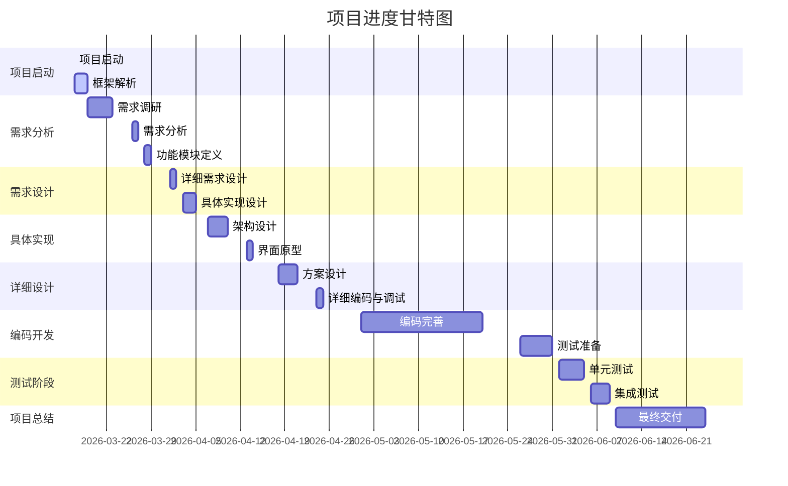

# 番茄商城项目启动文档

## 1. 项目名称
番茄商城线上购书平台
## 2. 项目背景
在数字阅读与纸质阅读融合发展的新趋势下，实体书市场呈现复苏态势。数据显示，超过60%的读者认为实体书具有不可替代的收藏价值和阅读体验。为满足用户对优质购书体验的需求，番茄读书依托自身图书资源优势和供应链体系，拟开发线上商城系统，构建集书籍展示、智能推荐、快捷支付、库存管理于一体的数字化购书平台。通过前后端分离技术架构实现高效运维，助力出版社拓展销售渠道，为读者打造沉浸式购书场景。
## 3. 项目目标
- 用户体验优化
构建响应式前端界面，实现3秒快速注册/登录，支持个性化推荐算法，确保99.9%的系统可用性。
- 管理效能提升
开发智能化库存预警系统，支持批量操作功能，使管理员处理效率提升40%以上。
- 业务生态拓展
预留API接口对接第三方物流系统，建立用户阅读行为分析模型，为后续精准营销提供数据支撑。
- 系统安全合规
采用JWT+HTTPS双重认证机制，确保用户数据符合GDPR隐私保护标准。
## 4. 项目范围
### 4.1 功能模块
- 用户模块
多端账号体系（手机号/邮箱/第三方社交登录）
个人中心信息管理（收货地址/阅读偏好设置）
行为轨迹追踪（浏览历史/收藏记录）
- 商品管理模块
三级分类体系（图书大类/细分品类/出版社维度）
动态库存同步机制（支持并发场景下的库存锁定）
商品上下架生命周期管理
- 订单支付模块
分布式订单号生成服务
多支付方式集成（支付宝/微信/银联）
订单状态机（待支付→已发货→已完成→已取消）
- 广告模块
轮播图管理（支持定时上下线）
推荐位算法（基于用户画像的A/B测试）
营销活动配置（满减/折扣/优惠券）

## 5. 项目里程碑及时间表
### **必选需求的时间表**
1. Week5：用户模块  
2. Week6：货物管理与查询模块  
3. Week7：交易与支付管理模块  
4. Week8：广告管理模块，补充 Week6、Week7 的内容  

### **自由需求的时间表**
<table>
            <tr>
                <th>活动</th>
                <th>活动项目</th>
                <th>详细细项内容</th>
                <th>开始日</th>
                <th>结束日</th>
            </tr>
            <tr>
                <td rowspan="3">1. 项目启动</td>
                <td>项目启动</td>
                <td>确定团队分工、工作目标等</td>
                <td>3月17日</td>
                <td>3月17日</td>
            </tr>
            <tr>
                <td>项目基本框架解析</td>
                <td>复盘+头脑风暴，分析项目整体框架及可行性</td>
                <td>3月17日</td>
                <td>3月18日</td>
            </tr>
            <tr>
                <td>项目基本框架解析</td>
                <td>调整及优化基本框架，补充未考虑的部分</td>
                <td>3月18日</td>
                <td>3月19日</td>
            </tr>
            <tr>
                <td rowspan="3">2. 需求分析</td>
                <td>需求调研</td>
                <td>受众需求调研、功能模块拆解、核心功能定义</td>
                <td>3月19日</td>
                <td>3月23日</td>
            </tr>
            <tr>
                <td>需求分析</td>
                <td>评估数据需求，形成数据需求文档</td>
                <td>3月26日</td>
                <td>3月27日</td>
            </tr>
            <tr>
                <td>功能模块定义</td>
                <td>分析各个模块功能，给出需求文档，评估需求优先级</td>
                <td>3月28日</td>
                <td>3月29日</td>
            </tr>
            <tr>
                <td rowspan="2">3. 需求设计</td>
                <td>模块详细需求设计</td>
                <td>定义各个功能模块的详细需求，输出详细需求文档</td>
                <td>4月1日</td>
                <td>4月2日</td>
            </tr>
            <tr>
                <td>模块具体实现设计</td>
                <td>详细定义模块内部逻辑、数据流、交互等</td>
                <td>4月3日</td>
                <td>4月5日</td>
            </tr>
            <tr>
                <td rowspan="2">4. 具体实现设计</td>
                <td>架构设计</td>
                <td>定义整体系统架构，明确开发语言、框架、数据库等</td>
                <td>4月7日</td>
                <td>4月10日</td>
            </tr>
            <tr>
                <td>界面原型与修正</td>
                <td>界面设计和原型绘制，并根据需求修正</td>
                <td>4月13日</td>
                <td>4月14日</td>
            </tr>
            <tr>
                <td rowspan="2">5. 详细设计</td>
                <td>功能实现思路、实现方案设计</td>
                <td>编写实现思路，确定技术方案</td>
                <td>4月18日</td>
                <td>4月21日</td>
            </tr>
            <tr>
                <td>详细功能编码与调试</td>
                <td>编码实现各个模块，进行单元测试</td>
                <td>4月24日</td>
                <td>4月25日</td>
            </tr>
            <tr>
                <td rowspan="2">6. 编码</td>
                <td>编码开发完善</td>
                <td>完成编码开发，进行代码优化</td>
                <td>5月1日</td>
                <td>5月20日</td>
            </tr>
            <tr>
                <td>编码测试发布</td>
                <td>编写测试用例，进行集成测试，准备发布</td>
                <td>5月26日</td>
                <td>5月31日</td>
            </tr>
            <tr>
                <td rowspan="2">7. 测试</td>
                <td>单元测试</td>
                <td>测试功能模块的独立性和正确性</td>
                <td>6月1日</td>
                <td>6月5日</td>
            </tr>
            <tr>
                <td>集成测试</td>
                <td>测试各个模块的协同工作</td>
                <td>6月6日</td>
                <td>6月9日</td>
            </tr>
            <tr>
                <td colspan="2">8. 项目总结</td>
                <td>项目总结，项目最终交付</td>
                <td>6月10日</td>
                <td>6月24日</td>
            </tr>
        </table>

## 6. 甘特图

## 7. 资源概览和任务分配
###  7.1 开发环境与工具链
前端 Vue3 + TypeScript + Pinia 构建SPA应用，支持SSR渲染 
后端 Spring Boot 3.x + JPA + Hibernate 实现RESTful API，集成Swagger 
数据库 MySQL 8.0 + Redis 7.0 主从复制，读写分离   
### 7.2任务分配  
前端：郑鸣东、赖文略；后端：杨真昊、张广烨
## 8. 人员配置表
| 序号  | 职务  |  姓名  |   学号    |    电话     |
| :---: | :---: | :----: | :-------: | :---------: |
|  1.   | 前端  | 郑鸣东 | 231880514 | 17767666802 |
|  2.   | 前端  | 赖文略 | 231880507 | 15159671970 |
|  3.   | 后端  | 张广烨 | 231880498 | 17859960360 |
|  4.   | 后端  | 杨真昊 | 231880513 | 13779334002 |

